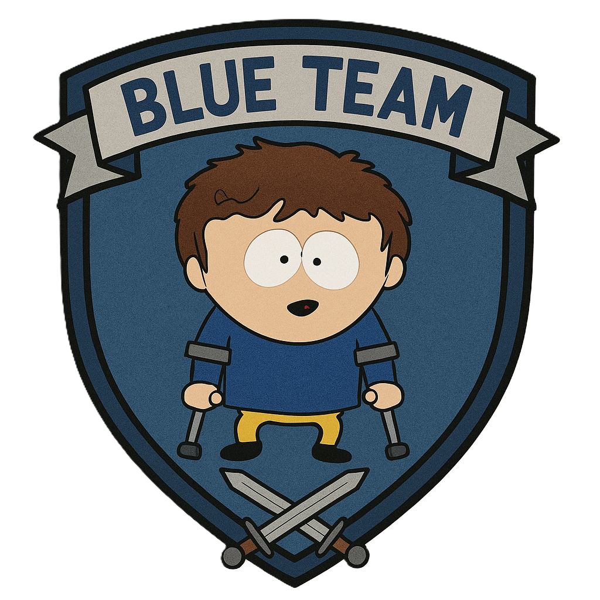

   
  

<h1 align="center">🛡️ BTL1 Practical Study Guide 🛡️</h1>

  <em>A Hands-On Companion for the Blue Team Level 1 Certification</em>

  
  
  
  

---

> ## 🚀 Welcome Blue Teamer!
>
> Welcome to this practical study guide designed to equip you with the hands-on skills needed for the **Security Blue Team - Blue Team Level 1 (BTL1)** certification. Drawing from real-world experience and a deep understanding of the BTL1 domains, this repository compiles essential notes, cheatsheets, workflows, and resources.
>
> BTL1 tests **practical application**, not just theoretical knowledge. This guide mirrors that philosophy, focusing intently on _what actions to take_, _how to perform them_, and _which tools to leverage_ effectively in realistic security scenarios.

---

## 🎯 Who is This Guide For?

This resource is tailored for:

* 👨‍🎓 **Aspiring BTL1 Candidates:** Individuals actively preparing for the certification exam.
* 💻 **Junior Cyber Professionals:** SOC Analysts (Tier 1/2), Junior Incident Responders, SysAdmins, or IT professionals aiming to transition into or solidify their skills in defensive security roles.
* 🛡️ **Cyber Defense Enthusiasts:** Anyone passionate about learning practical Blue Team operations through a structured, hands-on approach.

> **Assumed Knowledge:** A foundational grasp of networking (TCP/IP, DNS, HTTP), operating systems (Windows & Linux command-line basics), and core cybersecurity concepts will be beneficial.

---

## ✨ Key Features

* **🛠️ Hands-On Focus:** Directly aligned with the practical, scenario-based nature of the BTL1 exam.
* **📄 Detailed Cheatsheets:** Quick-reference guides for crucial commands and tool functionalities.
* **💡 Structured Workflows:** Step-by-step methodologies for common analysis tasks (Phishing, IoC Investigation, etc.).
* **🧩 Modular Organization:** Content arranged by official BTL1 domains for focused learning.
* **🔗 Curated Resources:** Vetted links to essential tools, official documentation, and effective practice platforms.

---

<strong>🧰 Main Tools Covered</strong>

 

> This guide explores the practical application of key tools encountered in the BTL1 certification environment and common in security analysis roles:

* **SIEM:** `Splunk` (using SPL), `Elastic Stack` (ELK Stack fundamentals)
* **Network Traffic Analysis:** `Wireshark`, `Tshark`
* **Memory Forensics:** `Volatility 2` / `Volatility 3`
* **Disk Forensics:** `Autopsy`, `The Sleuth Kit (TSK)`, `FTK Imager`
* **Endpoint Data Collection:** `KAPE` (Kroll Artifact Parser and Extractor)
* **File/Malware Analysis:** `VirusTotal`, `Hybrid Analysis`, `Any.Run`, `ExifTool`
* **File Carving:** `Scalpel`, `Foremost`
* **Log Analysis (CLI):** Native commands (Linux/Windows), `Sysinternals Suite`
* **Threat Intelligence Platforms:** `URLhaus`, `AbuseIPDB`, `OTX`

---

## 🧭 Repository Structure

> The guide is logically organized into modules reflecting the core BTL1 domains. Consult the `README.md` within each module folder for specific contents.

| Module                       | Brief Description                                                          | Status      |
| :--------------------------- | :------------------------------------------------------------------------- | :---------- |
| `00_Introduction_BTL1`     | BTL1 fundamentals, critical thinking, and exam strategy.                   | `Completed` |
| `01_Phishing_Analysis`     | Dissecting emails, analyzing headers, URLs, and attachments.               | `Completed` |
| `02_Threat_Intelligence`   | Applying CTI, `IoCs`, `TTPs`, and the `MITRE ATT&CK` Framework.            | `Completed` |
| `03_Digital_Forensics`     | Acquiring and analyzing evidence from disk and memory (`Win`/`Lin`).         | `Completed` |
| `04_SIEM_Analysis`         | Searching, correlating, and analyzing logs in `Splunk`.                      | `Completed` |
| `05_Network_Analysis`      | Interpreting `PCAP`s, identifying protocols, and spotting anomalies.        | `Completed` |
| `06_Incident_Response`     | Lifecycle, live response techniques, containment concepts.                 | `Completed` |
| `assets/`                    | Supporting images, diagrams, etc.                                          | `N/A`       |
| `CONTRIBUTING.md`            | Guidelines for contributing.                                               | `Available` |
| `CODE_OF_CONDUCT.md`       | Community standards.                                                       | `Available` |
| `LICENSE`                    | MIT License details.                                                       | `Available` |
---

## 🗺️ Detailed Table of Contents

<strong>► Click to Navigate Study Modules</strong>

 

* [**🚀 Introduction & Strategy (`./00_Introduction_BTL1/`)**](./00_Introduction_BTL1/)
    * [What is BTL1?](./00_Introduction_BTL1/01_What_is_BTL1.md)
    * [Exam Philosophy](./00_Introduction_BTL1/02_Exam_Philosophy.md)
    * [General Strategy](./00_Introduction_BTL1/03_General_Strategy.md)
* [**🎣 Phishing Analysis (`./01_Phishing_Analysis/`)**](./01_Phishing_Analysis/)
    * [Key Concepts](./01_Phishing_Analysis/01_Key_Concepts.md)
    * [Essential Tools](./01_Phishing_Analysis/02_Tools.md)
    * [Commands Cheatsheet](./01_Phishing_Analysis/03_Commands_Cheatsheet.md)
    * [Analysis Workflow](./01_Phishing_Analysis/04_Analysis_Workflow.md)
    * [Practice Resources](./01_Phishing_Analysis/05_Practice_Resources.md)
* [**💡 Threat Intelligence (`./02_Threat_Intelligence/`)**](./02_Threat_Intelligence/)
    * [Key Concepts](./02_Threat_Intelligence/01_Key_Concepts.md)
    * [MITRE ATT&CK Framework](./02_Threat_Intelligence/02_MITRE_ATTACK.md)
    * [Key Tools](./02_Threat_Intelligence/03_Tools.md)
    * [IoC Investigation Workflow](./02_Threat_Intelligence/04_IoC_Workflow.md)
    * [Practice Resources](./02_Threat_Intelligence/05_Practice_Resources.md)
* [**🕵️ Digital Forensics (`./03_Digital_Forensics/`)**](./03_Digital_Forensics/)
    * [Evidence Acquisition](./03_Digital_Forensics/01_Acquisition.md)
    * [Disk Analysis (`./02_Disk_Analysis/`)](./03_Digital_Forensics/02_Disk_Analysis/)
        * [Windows Artifacts](./03_Digital_Forensics/02_Disk_Analysis/Windows_Artifacts.md)
        * [Linux Artifacts](./03_Digital_Forensics/02_Disk_Analysis/Linux_Artifacts.md)
        * [Common Tools](./03_Digital_Forensics/02_Disk_Analysis/Disk_Tools.md)
        * [File Carving (`Scalpel`)](./03_Digital_Forensics/02_Disk_Analysis/File_Carving_Scalpel.md)
        * [Metadata (`ExifTool`)](./03_Digital_Forensics/02_Disk_Analysis/Metadata_ExifTool.md)
    * [Memory Analysis (`./03_Memory_Analysis/`)](./03_Digital_Forensics/03_Memory_Analysis/)
        * [Key Concepts & Artifacts](./03_Digital_Forensics/03_Memory_Analysis/Key_Concepts.md)
        * [Volatility Tool](./03_Digital_Forensics/03_Memory_Analysis/Volatility_Tool.md)
    * [Practice Resources](./03_Digital_Forensics/04_Practice_Resources.md)
* [**📊 SIEM Analysis (`./04_SIEM_Analysis/`)**](./04_SIEM_Analysis/)
    * [Key Concepts](./04_SIEM_Analysis/01_Key_Concepts.md)
    * [Splunk Cheatsheet](./04_SIEM_Analysis/02_Splunk_Cheatsheet.md)
    * [Common Searches](./04_SIEM_Analysis/03_Common_Searches.md)
    * [Practice Resources](./04_SIEM_Analysis/04_Practice_Resources.md)
* [**🌐 Network Analysis (`./05_Network_Analysis/`)**](./05_Network_Analysis/)
    * [Key Concepts](./05_Network_Analysis/01_Key_Concepts.md)
    * [Wireshark / Tshark](./05_Network_Analysis/02_Wireshark_Tshark.md)
    * [Filters Cheatsheet](./05_Network_Analysis/03_Filters_Cheatsheet.md)
    * [Specific Protocol Analysis](./05_Network_Analysis/04_Specific_Protocol_Analysis.md)
    * [Malicious Patterns](./05_Network_Analysis/05_Malicious_Patterns.md)
    * [Practice Resources](./05_Network_Analysis/06_Practice_Resources.md)
* [**🔥 Incident Response (`./06_Incident_Response/`)**](./06_Incident_Response/)
    * [IR Lifecycle](./06_Incident_Response/01_IR_Lifecycle.md)
    * [Live Response (Windows)](./06_Incident_Response/02_Live_Response_Windows.md)
    * [Live Response (Linux)](./06_Incident_Response/03_Live_Response_Linux.md)
    * [Containment & Eradication (Concepts)](./06_Incident_Response/04_Containment_Eradication.md)
    * [Practice Resources](./06_Incident_Response/05_Practice_Resources.md)

---

## ⭐ How to Use This Guide Effectively

1.  **🎯 Target Your Study:** Use the Table of Contents or `Repository Structure` to navigate to specific BTL1 domains or tools.
2.  **🧠 Understand Concepts:** Read the "Key Concepts" sections first to grasp the fundamentals.
3.  **🛠️ Learn the Tools:** Review cheatsheets and practice with the essential tools (`Volatility`, `Splunk`, `Wireshark`, `Autopsy`, etc.).
4.  **⚙️ Apply Workflows:** Use the suggested workflows as a baseline for your analysis process in practice labs.
5.  **🧪 Practice Relentlessly:** The key to BTL1 success is hands-on practice. Use resources like BTLO, CyberDefenders, TryHackMe, and BOTS datasets. This guide serves as your reference during practice.
6.  **✍️ Adapt & Contribute:** This is a living guide. Fork it, add your insights, or suggest improvements via [Issues](../../issues) or Pull Requests. See [`CONTRIBUTING.md`](./CONTRIBUTING.md).

---

## 🤝 Contributions and Feedback

> While originating from personal study notes (including experience leading to a BTL1 Gold Coin), this guide aims to be a valuable community resource. Contributions are welcome! Please refer to the [`CONTRIBUTING.md`](./CONTRIBUTING.md) file for guidelines and open an [Issue](../../issues) for suggestions or bug reports.

---

## ⚠️ Disclaimer and Confidentiality

> The information herein is based on personal experience, study of BTL1 domain concepts, and publicly available resources. Cybersecurity is dynamic; **always cross-reference with the official BTL1 syllabus and tool documentation.** Use this information responsibly.
>
> **Crucially: The Security Blue Team Non-Disclosure Agreement (NDA) is strictly respected.** This repository **does not** contain specific exam content, direct solutions, or any proprietary information protected by the NDA. It focuses on consolidating knowledge and techniques applicable to the BTL1 domains in general.

---

## 📄 License

Distributed under the **MIT License**. See the [`LICENSE`](./LICENSE) file for more details.

---

 
  
  

